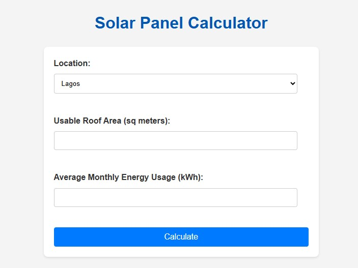
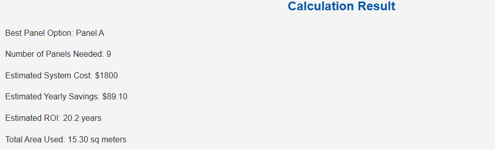

DESCRIPTION
This is a simple but helpful web app built with Flask that guides users in choosing the right solar panel system for their home or business. It takes into account how much energy you use, sunlight data for your location, and available solar panel options. It even breaks down the cost, shows your return on investment, and gives you a visual idea of how the panels would be laid out.

SETUP INSTRUCTIONS
Clone the repository; git clone https://github.com/your-username/solar-sizing-advisor.git cd solar-sizing-advisor
Create a virtual environment; python -m venv venv source venv/bin/activate  # On Windows: venv\Scripts\activate
Install dependencies; pip install -r requirements.txt
Run the app; flask run

TEAM MEMBERS
Daniel Stephanie SEN-22-7155 - Back End developer, Documentation
Ede Precious SEN-22-8397 - Front End developer
Ejekoko Stephanie SEN-23-9892 - Data analyst

DATASET SOURCES
https://www.energy.gov/data-catalog
https://www.nrel.gov/grid/solar-resource-data.html

ADDED SCREENSHOTS
Home

Analysis

